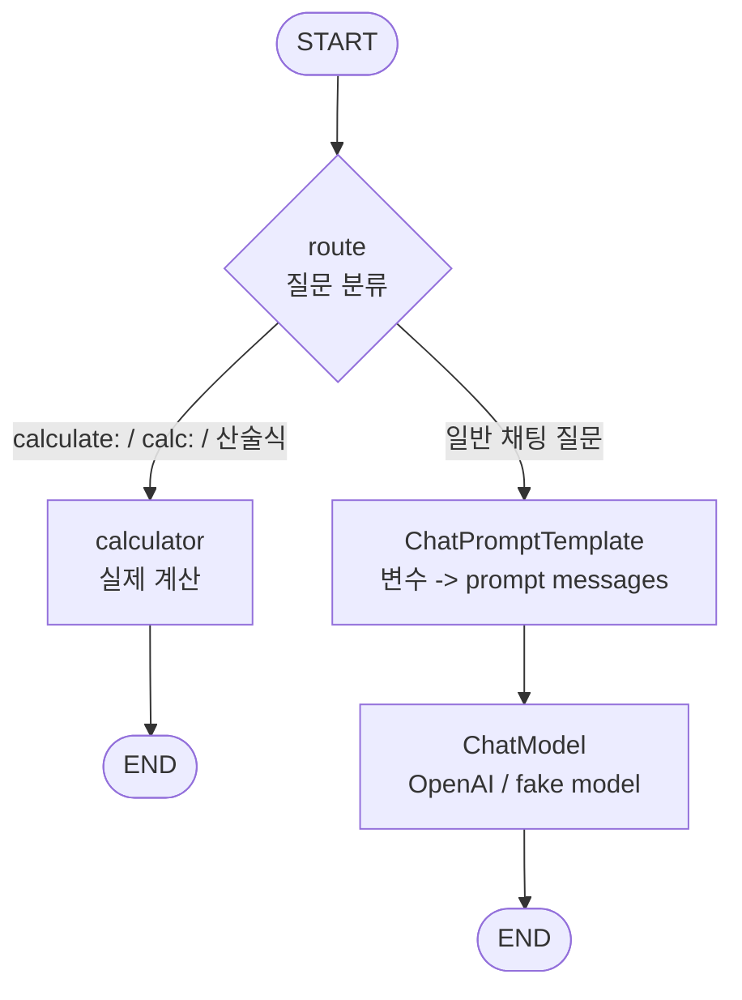
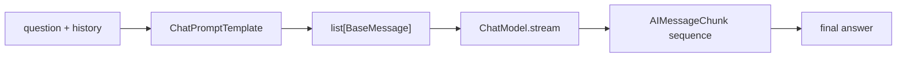
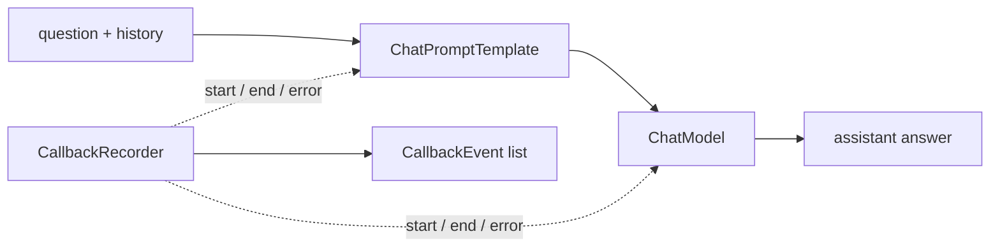
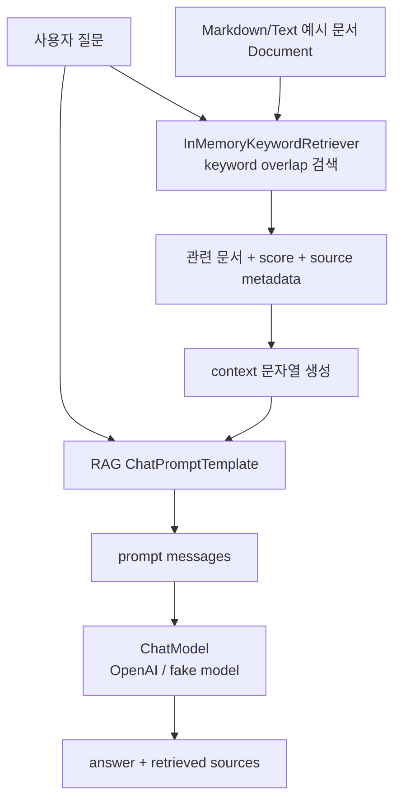

# agent-learning

Python, LangChain, LangGraph로 agent 애플리케이션의 기본 구성 요소를 단계별로 익히는 학습 저장소입니다. Go와 CloudWeGo Eino로 작성된 `../eino-learning`의 Chapter 01-09 학습 흐름을 Python 생태계에 맞춰 옮겼습니다.

처음에는 외부 LLM API 없이 fake model과 local testdata로 구조와 테스트 방법을 먼저 익힙니다. 실제 OpenAI 호출은 `RUN_AGENT_LEARNING_INTEGRATION=1`을 명시했을 때만 opt-in으로 실행합니다.

## Setup

요구 사항:

- Python 3.11 이상
- `uv`
- 실제 OpenAI integration 실행 시 `OPENAI_API_KEY`

설치와 기본 테스트:

```bash
uv sync
uv run pytest
```

기본 `uv run pytest`는 외부 API를 호출하지 않습니다.

실제 OpenAI 연동 테스트:

```bash
RUN_AGENT_LEARNING_INTEGRATION=1 uv run pytest tests/test_openai_integration.py -v
```

`OPENAI_API_KEY`가 없으면 integration tests는 skip됩니다.

## Project Structure

```text
examples/
  ch01_chatmodel.py
  ch02_prompt_template.py
  ch03_openai_chatmodel.py
  ch04_tool_calling.py
  ch05_chain.py
  ch06_graph.py
  ch07_streaming.py
  ch08_callback_observability.py
  ch09_rag.py
src/agent_learning/
  fake.py
  llm/
    prompting.py
    chat.py
    openai.py
    toolcalling.py
    chain.py
    graph.py
    streaming.py
    observability.py
    rag.py
  tools/
    calculator.py
tests/
  test_chapters.py
  test_openai_integration.py
testdata/
  docs/ch09-rag/
```

Python판의 주요 대응 관계:

- Eino `ChatModel` -> LangChain chat model `invoke`/`stream`
- Eino `ChatTemplate` -> LangChain `ChatPromptTemplate`
- Eino `WithTools` -> LangChain `bind_tools`
- Eino `ToolsNode` -> local tool execution loop + `ToolMessage`
- Eino `Graph` -> LangGraph `StateGraph`
- Eino `Retriever` -> `InMemoryKeywordRetriever`

## Environment

`.env` 예시:

```env
OPENAI_API_KEY=your-api-key
OPENAI_MODEL=gpt-4.1-mini
OPENAI_BASE_URL=
RUN_AGENT_LEARNING_INTEGRATION=1
```

설정 우선순위:

1. Shell 환경 변수
2. repository root의 `.env`
3. 코드 기본값

기본 모델명은 `gpt-4.1-mini`입니다.

## Chapter 01. ChatModel

이번 장의 목표:

- LangChain chat model의 기본 역할을 이해합니다.
- `FakeChatModel`을 만들어 외부 API 없이 질문/응답 흐름을 테스트합니다.
- 이후 OpenAI 모델로 교체 가능한 service 경계를 만듭니다.

핵심 개념:

- `src/agent_learning/fake.py`는 테스트용 fake chat model을 제공합니다.
- `src/agent_learning/llm/chat.py`의 `ChatService`는 model을 받아 질문/응답 흐름을 실행합니다.
- `examples/ch01_chatmodel.py`는 fake model을 사용하는 최소 실행 예제입니다.

실행 명령:

```bash
uv run python examples/ch01_chatmodel.py "What is LangChain?"
```

테스트 명령:

```bash
uv run pytest tests/test_chapters.py::test_ch01_chat_service_uses_fake_model -q
```

다음 장에서 할 일:

- Chapter 02에서 system/user/assistant message와 prompt template을 구조화합니다.
- 실제 OpenAI 연동은 Chapter 03에서 opt-in integration test로 분리합니다.

## Chapter 02. Prompt Template과 Message 설계

이번 장의 목표:

- LangChain `ChatPromptTemplate`이 변수를 chat message 목록으로 바꾸는 흐름을 이해합니다.
- system prompt, optional chat history, user question 순서의 message 설계를 테스트합니다.
- `ChatService`가 template으로 만든 message를 model에 전달하게 만듭니다.

핵심 개념:

- `default_chat_prompt()`는 system message, optional `MessagesPlaceholder("history")`, user question을 순서대로 정의합니다.
- `format_messages()`는 blank question을 먼저 거부하고 `list[BaseMessage]`를 반환합니다.
- fake model의 `last_input`으로 실제 model에 들어간 role/content 순서를 검증합니다.

실행 명령:

```bash
uv run python examples/ch02_prompt_template.py "How does ChatPromptTemplate work?"
```

테스트 명령:

```bash
uv run pytest tests/test_chapters.py::test_ch02_prompt_formats_system_history_and_question -q
```

다음 장에서 할 일:

- Chapter 03에서 `ChatOpenAI`를 같은 service 경계에 주입합니다.

## Chapter 03. OpenAI ChatModel 연동

이번 장의 목표:

- `langchain_openai.ChatOpenAI`를 `ChatService`에 주입합니다.
- `.env` 또는 환경 변수의 `OPENAI_API_KEY`, `OPENAI_MODEL`, `OPENAI_BASE_URL`로 provider 설정을 분리합니다.
- 실제 API 호출은 `RUN_AGENT_LEARNING_INTEGRATION=1`일 때만 실행되게 만듭니다.

핵심 개념:

- `src/agent_learning/llm/openai.py`는 `OpenAIConfig`, `load_config_from_env()`, `new_chat_model()`을 제공합니다.
- 기본 모델명은 `.env.example`과 같은 `gpt-4.1-mini`입니다.
- unit test는 API를 호출하지 않고, integration test만 opt-in으로 실제 OpenAI API를 호출합니다.
- `examples/ch03_openai_chatmodel.py`는 integration flag가 없으면 API 호출 없이 안내 후 종료합니다.

기본 실행 명령:

```bash
uv run python examples/ch03_openai_chatmodel.py "What does ChatOpenAI do?"
```

실제 OpenAI 실행:

```bash
RUN_AGENT_LEARNING_INTEGRATION=1 uv run python examples/ch03_openai_chatmodel.py "What does ChatOpenAI do?"
```

integration test:

```bash
RUN_AGENT_LEARNING_INTEGRATION=1 uv run pytest tests/test_openai_integration.py::test_openai_chat_model_integration -v
```

외부 API 없이 전체 테스트:

```bash
uv run pytest
```

## Chapter 04. Tool Calling

이번 장의 목표:

- LangChain tool metadata와 실제 tool 실행 경계를 이해합니다.
- `model.bind_tools()`로 model에게 tool schema를 전달합니다.
- model이 생성한 `tool_calls`를 allowlist 기반으로 실행해 `ToolMessage`를 만듭니다.
- tool 결과를 message history에 붙여 model에게 최종 답변을 다시 요청합니다.

핵심 개념:

- tool은 model에게 보여줄 schema와 실제 실행 함수가 함께 있어야 합니다.
- 이번 장의 `calculator` tool은 `+`, `-`, `*`, `/`, 괄호만 지원하는 안전한 실제 계산 tool입니다.
- `ToolCallingService`는 `model -> tool calls -> ToolMessage -> model final answer` loop를 실행합니다.
- 초반 chapter에서는 shell, 파일 삭제, 배포 같은 위험 tool을 등록하지 않습니다.
- Python AST whitelist에서 `True` 같은 bool literal과 함수 호출은 거부합니다.

실행 명령:

```bash
uv run python examples/ch04_tool_calling.py "12 * (7 + 3)"
```

테스트 명령:

```bash
uv run pytest tests/test_chapters.py::test_ch04_calculator_supports_safe_arithmetic_and_rejects_calls -q
uv run pytest tests/test_chapters.py::test_ch04_tool_calling_executes_calculator_loop -q
```

실제 OpenAI tool calling integration test:

```bash
RUN_AGENT_LEARNING_INTEGRATION=1 uv run pytest tests/test_openai_integration.py::test_openai_tool_calling_integration -v
```

다음 장에서 할 일:

- Chapter 05에서 `ChatPromptTemplate`과 ChatModel을 runnable chain으로 연결합니다.

## Chapter 05. Chain 구성

이번 장의 목표:

- LangChain runnable composition으로 선형 component pipeline을 구성합니다.
- 기존 `ChatPromptTemplate -> ChatModel` 흐름을 직접 호출 대신 `prompt | model` runnable로 실행합니다.
- unit test는 fake model로 검증하고, integration test는 실제 `ChatOpenAI`로 실행합니다.

핵심 개념:

- Chain은 component를 순서대로 연결해 하나의 runnable처럼 실행합니다.
- 이번 장의 Chain은 `dict[str, object] -> ChatPromptTemplate -> ChatModel -> BaseMessage` 흐름입니다.
- `ChainService.ask_with_trace()`는 input variables, prompt messages, model response를 단계별로 보여줍니다.
- tool calling처럼 반복이나 조건이 필요한 흐름은 이후 Graph/Agent 장에서 더 자연스럽게 다룹니다.

실행 명령:

```bash
uv run python examples/ch05_chain.py "How does Chain work?"
```

테스트 명령:

```bash
uv run pytest tests/test_chapters.py::test_ch05_chain_service_runs_prompt_model_chain_with_trace -q
```

실제 OpenAI Chain integration test:

```bash
RUN_AGENT_LEARNING_INTEGRATION=1 uv run pytest tests/test_openai_integration.py::test_openai_chain_integration -v
```

다음 장에서 할 일:

- Chapter 06에서 Graph로 분기와 더 복잡한 실행 흐름을 다룹니다.

## Chapter 06. Graph 구성

이번 장의 목표:

- LangGraph `StateGraph`로 명시적인 node와 edge를 가진 실행 흐름을 구성합니다.
- conditional edge로 입력에 따라 calculator branch 또는 chat model branch를 선택합니다.
- Chain보다 Graph가 어울리는 분기 흐름을 실제 실행 출력으로 확인합니다.

핵심 개념:

- Graph는 `START`, named node, `END`를 edge로 직접 연결합니다.
- 이번 장의 Graph는 `route` node에서 질문을 분류합니다.
- `calculate:` 또는 `calc:` 질문은 `calculator` branch에서 실제 계산하고 model을 호출하지 않습니다.
- 일반 질문은 `prompt -> model` branch로 이동합니다.
- CLI는 선택된 route와 final answer를 보여줍니다.

Graph 다이어그램:



Node 주석:

- `route`: 질문을 보고 계산 branch 또는 채팅 branch를 선택합니다.
- `calculator`: `calculate()`를 직접 호출하므로 ChatModel을 호출하지 않습니다.
- `prompt`: system, history, user question 메시지 목록을 만듭니다.
- `model`: 일반 질문 branch에서만 실제 model을 호출합니다.

실행 명령:

```bash
uv run python examples/ch06_graph.py
```

단일 질문 실행:

```bash
uv run python examples/ch06_graph.py "calculate: 7 * (8 + 2)"
```

테스트 명령:

```bash
uv run pytest tests/test_chapters.py::test_ch06_graph_routes_calculation_without_model_call_and_chat_with_model_call -q
```

실제 OpenAI Graph integration test:

```bash
RUN_AGENT_LEARNING_INTEGRATION=1 uv run pytest tests/test_openai_integration.py::test_openai_graph_integration -v
```

다음 장에서 할 일:

- Chapter 07에서 Streaming을 다룹니다.

## Chapter 07. Streaming

이번 장의 목표:

- LangChain chat model의 `stream()`이 chunk를 순서대로 반환하는 흐름을 이해합니다.
- chunk를 반복해서 받아 최종 answer로 합칩니다.
- unit test는 fake streaming model로 검증하고, integration test는 실제 `ChatOpenAI`로 실행합니다.

핵심 개념:

- Streaming은 완성된 assistant message를 기다리지 않고, 생성되는 조각을 순서대로 읽습니다.
- 이번 장의 흐름은 `question + history -> ChatPromptTemplate -> ChatModel.stream -> chunk collection`입니다.
- `StreamingService.ask_with_history()`는 stream chunk를 모아 `StreamingResult`로 반환합니다.

Streaming 다이어그램:



실행 명령:

```bash
uv run python examples/ch07_streaming.py "How does streaming work?"
```

테스트 명령:

```bash
uv run pytest tests/test_chapters.py::test_ch07_streaming_collects_chunks -q
```

실제 OpenAI Streaming integration test:

```bash
RUN_AGENT_LEARNING_INTEGRATION=1 uv run pytest tests/test_openai_integration.py::test_openai_streaming_integration -v
```

다음 장에서 할 일:

- Chapter 08에서 Callback과 Observability를 다룹니다.

## Chapter 08. Callback과 Observability

이번 장의 목표:

- prompt/model 실행의 lifecycle event를 관찰합니다.
- `CallbackRecorder`로 chain, prompt, model의 start/end/error event를 수집합니다.
- `ChatPromptTemplate -> ChatModel` 흐름에서 실행 과정을 출력합니다.

핵심 개념:

- Callback은 component 실행 전후와 error 시점에 호출되는 관찰 hook입니다.
- Python판은 Eino callback API를 그대로 복제하는 대신 학습용 `CallbackRecorder`로 같은 관찰 개념을 보여줍니다.
- Callback은 답변을 대신 만들지 않고 옆에서 start/end/error event를 기록합니다.
- Unit test는 fake model로 event 순서를 검증하고, integration test는 실제 OpenAI ChatModel로 실행합니다.

Callback 다이어그램:



테스트에서는 `chain start -> prompt start/end -> model start/end -> chain end` 순서가 기록되는지 확인합니다. 이 검증 덕분에 callback이 주 실행 흐름을 바꾸는 기능이 아니라 실행 과정을 관찰하는 기능이라는 점을 코드로도 확인할 수 있습니다.

실행 명령:

```bash
uv run python examples/ch08_callback_observability.py "How do callbacks help?"
```

한국어 예시 질문:

```bash
uv run python examples/ch08_callback_observability.py "callback observability는 무엇을 관찰하나요?"
```

테스트 명령:

```bash
uv run pytest tests/test_chapters.py::test_ch08_observability_records_chain_events -q
```

실제 OpenAI Observability integration test:

```bash
RUN_AGENT_LEARNING_INTEGRATION=1 uv run pytest tests/test_openai_integration.py::test_openai_observability_integration -v
```

다음 장에서 할 일:

- Chapter 09에서 RAG 기초를 다룹니다.

## Chapter 09. RAG 기초

이번 장의 목표:

- Retriever가 질문에 맞는 document를 반환하는 흐름을 이해합니다.
- Markdown/Text 예시 문서를 in-memory keyword retriever로 검색합니다.
- 검색된 document context를 prompt에 넣고 ChatModel 답변과 sources를 함께 출력합니다.
- RAG v1 범위를 작게 유지해 retrieval, prompt grounding, source 표시의 기본 구조에 집중합니다.

핵심 개념:

- RAG 흐름은 `question -> Retriever -> context prompt -> ChatModel -> answer + sources`입니다.
- `examples/ch09_rag.py`는 `testdata/docs/ch09-rag`의 `.md`, `.txt` 파일을 읽어 `Document`로 바꿉니다.
- 문서 title/source metadata는 최종 출력의 retrieved sources와 prompt context에 사용합니다.
- v1에서는 PDF parser, embedding provider, vector store를 사용하지 않습니다. 이런 기능은 후속 chapter 또는 확장 과제로 남깁니다.

RAG 흐름 그래프:



실행 명령:

```bash
uv run python examples/ch09_rag.py "Chapter 8 callback은 RAG에서 어떤 흐름을 관찰하나요?"
```

테스트 명령:

```bash
uv run pytest tests/test_chapters.py::test_ch09_rag_retrieves_keyword_context_and_sources -q
uv run pytest tests/test_chapters.py::test_ch09_load_documents_uses_first_text_line_as_title -q
```

실제 OpenAI RAG integration test:

```bash
RUN_AGENT_LEARNING_INTEGRATION=1 uv run pytest tests/test_openai_integration.py::test_openai_rag_integration -v
```

다음 장에서 할 일:

- Chapter 10에서 ReAct Agent를 다룹니다.

## 전체 검증 명령

외부 API 없이 전체 검증:

```bash
uv run pytest
uv run python -m compileall -q src examples tests
uv lock --check
```

실제 OpenAI integration 검증:

```bash
RUN_AGENT_LEARNING_INTEGRATION=1 uv run pytest tests/test_openai_integration.py -v
```

현재 구현에서 확인한 integration 범위:

- Chapter 03: `ChatOpenAI` factory와 `ChatService`
- Chapter 04: `bind_tools` 기반 calculator tool calling
- Chapter 05: runnable chain과 history prompt
- Chapter 06: LangGraph calculator/chat routing
- Chapter 07: streaming chunk collection
- Chapter 08: observable chain event recording
- Chapter 09: keyword RAG, context prompt, source metadata
