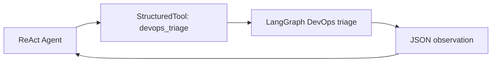
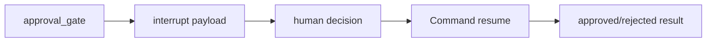

# Notes

## Implementation Notes

- 공식 문서 기준 LangGraph는 `StateGraph`, `START`, `END`, `add_conditional_edges`, `compile`, `invoke` 패턴을 사용합니다.
- 공식 문서 기준 LangChain은 `ChatPromptTemplate`, `ChatOpenAI`, `bind_tools`, `ToolMessage`, `StructuredTool` 패턴을 사용합니다.
- 공식 문서 기준 Anthropic 연동은 `langchain_anthropic.ChatAnthropic`과 `bind_tools`를 사용하며, tool 실행은 host loop가 처리합니다.
- Chapter 09는 embedding/vector store 없이 in-memory keyword retrieval만 다룹니다.
- Chapter 10은 local `stdio` transport로 MCP server process와 client session을 함께 실행합니다.
- Chapter 11은 `llm_call -> tool_node -> llm_call` LangGraph loop로 ReAct 흐름을 보여줍니다.
- Chapter 12는 `Agent -> GraphTool -> Graph nodes -> JSON observation -> Agent final answer` 흐름을 보여줍니다.
- Chapter 13은 `interrupt payload -> human decision -> Command resume -> approved/rejected result` 흐름을 보여줍니다.

## Documentation Notes

- README는 빠른 시작과 전체 구조를 보여주는 entrypoint로 유지합니다.
- Chapter별 상세 학습 내용은 `guides/chapters/<chapter>.md`에 둡니다.
- 새 chapter를 추가할 때는 README의 Learning Map, `guides/chapters.md` 인덱스, chapter별 상세 문서, roadmap, progress를 함께 갱신합니다.

## Safety Notes

- 외부 API 호출은 `RUN_AGENT_LEARNING_INTEGRATION=1` 명시 opt-in일 때만 실행합니다.
- 출력에는 API key 값을 포함하지 않습니다.
- 위험한 shell/filesystem/deployment tool은 학습용 tool calling chapter에 등록하지 않습니다.
- Chapter 13 Human-in-the-loop은 decision만 기록하고 paging, rollback, deployment action은 실행하지 않습니다.
