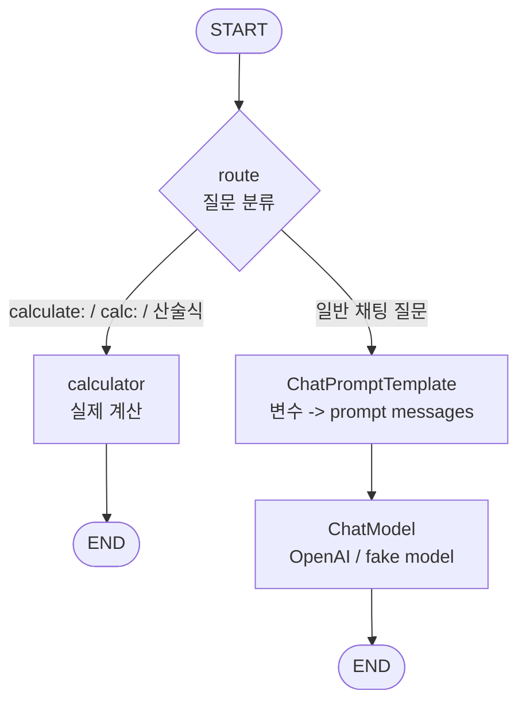

# Chapter 06. Graph 구성

## 목표

- LangGraph `StateGraph`로 명시적인 node와 edge를 가진 실행 흐름을 구성합니다.
- conditional edge로 입력에 따라 calculator branch 또는 chat model branch를 선택합니다.
- Chain보다 Graph가 어울리는 분기 흐름을 실제 실행 출력으로 확인합니다.

## 핵심 개념

- Graph는 `START`, named node, `END`를 edge로 직접 연결합니다.
- 이번 장의 Graph는 `route` node에서 질문을 분류합니다.
- `calculate:` 또는 `calc:` 질문은 `calculator` branch에서 실제 계산하고 model을 호출하지 않습니다.
- 일반 질문은 `prompt -> model` branch로 이동합니다.

## 흐름



## 실행 명령

```bash
uv run python examples/ch06_graph.py
uv run python examples/ch06_graph.py "calculate: 7 * (8 + 2)"
```

## 확인할 출력/테스트

CLI에서 확인할 부분:

- 일반 질문은 `prompt -> model` branch로 이동하는지 확인합니다.
- `calculate:` 또는 `calc:` 입력은 calculator branch에서 model 호출 없이 답하는지 확인합니다.
- `final answer`가 선택된 graph route의 결과와 맞는지 확인합니다.

테스트:

```bash
uv run pytest tests/test_chapters.py::test_ch06_graph_routes_calculation_without_model_call_and_chat_with_model_call -q
RUN_AGENT_LEARNING_INTEGRATION=1 uv run pytest tests/test_openai_integration.py::test_openai_graph_integration -v
```
