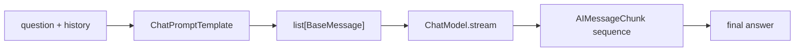

# Chapter 07. Streaming

## 목표

- LangChain chat model의 `stream()`이 chunk를 순서대로 반환하는 흐름을 이해합니다.
- chunk를 반복해서 받아 최종 answer로 합칩니다.
- unit test는 fake streaming model로 검증하고, integration test는 실제 provider ChatModel로 실행합니다.

## 핵심 개념

- Streaming은 완성된 assistant message를 기다리지 않고, 생성되는 조각을 순서대로 읽습니다.
- 이번 장의 흐름은 `question + history -> ChatPromptTemplate -> ChatModel.stream -> chunk collection`입니다.
- `StreamingService.ask_with_history()`는 stream chunk를 모아 `StreamingResult`로 반환합니다.

## 흐름



## 실행 명령

```bash
uv run python examples/ch07_streaming.py "How does streaming work?"
```

## 확인할 출력/테스트

CLI에서 확인할 부분:

- `stream chunks`가 순서대로 출력되는지 확인합니다.
- `chunk count`가 빈 chunk를 제외한 수로 집계되는지 확인합니다.
- `final answer`가 chunk를 이어 붙인 결과인지 확인합니다.

테스트:

```bash
uv run pytest tests/test_chapters.py::test_ch07_streaming_collects_chunks -q
RUN_AGENT_LEARNING_INTEGRATION=1 uv run pytest tests/test_openai_integration.py::test_openai_streaming_integration -v
```
