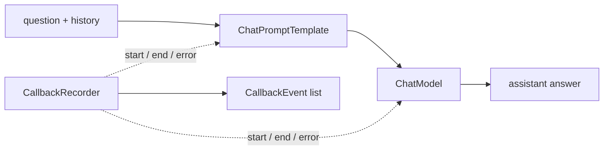

# Chapter 08. Callback과 Observability

## 목표

- prompt/model 실행의 lifecycle event를 관찰합니다.
- `CallbackRecorder`로 chain, prompt, model의 start/end/error event를 수집합니다.
- `ChatPromptTemplate -> ChatModel` 흐름에서 실행 과정을 출력합니다.

## 핵심 개념

- Callback은 component 실행 전후와 error 시점에 호출되는 관찰 hook입니다.
- Python판은 framework callback API 전체를 복제하는 대신 학습용 `CallbackRecorder`로 관찰 개념을 보여줍니다.
- Callback은 답변을 대신 만들지 않고 옆에서 start/end/error event를 기록합니다.
- Unit test는 fake model로 event 순서를 검증하고, integration test는 실제 provider ChatModel로 실행합니다.

## 흐름



테스트에서는 `chain start -> prompt start/end -> model start/end -> chain end` 순서가 기록되는지 확인합니다.

## 실행 명령

```bash
uv run python examples/ch08_callback_observability.py "How do callbacks help?"
uv run python examples/ch08_callback_observability.py "callback observability는 무엇을 관찰하나요?"
```

## 확인할 출력/테스트

CLI에서 확인할 부분:

- `callback events`가 chain, prompt, model lifecycle 순서로 기록되는지 확인합니다.
- error 없이 `chain end`까지 도달하는지 확인합니다.
- `final answer`가 callback 기록과 별도로 model response로 출력되는지 확인합니다.

테스트:

```bash
uv run pytest tests/test_chapters.py::test_ch08_observability_records_chain_events -q
RUN_AGENT_LEARNING_INTEGRATION=1 uv run pytest tests/test_openai_integration.py::test_openai_observability_integration -v
```
