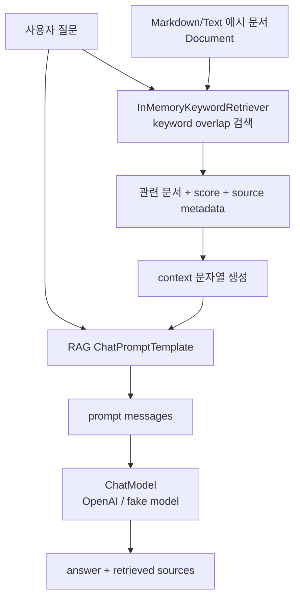

# Chapter 09. RAG 기초

## 목표

- Retriever가 질문에 맞는 document를 반환하는 흐름을 이해합니다.
- Markdown/Text 예시 문서를 in-memory keyword retriever로 검색합니다.
- 검색된 document context를 prompt에 넣고 ChatModel 답변과 sources를 함께 출력합니다.
- RAG v1 범위를 작게 유지해 retrieval, prompt grounding, source 표시의 기본 구조에 집중합니다.

## 핵심 개념

- RAG 흐름은 `question -> Retriever -> context prompt -> ChatModel -> answer + sources`입니다.
- `examples/ch09_rag.py`는 `testdata/docs/ch09-rag`의 `.md`, `.txt` 파일을 읽어 `Document`로 바꿉니다.
- 문서 title/source metadata는 최종 출력의 retrieved sources와 prompt context에 사용합니다.
- v1에서는 PDF parser, embedding provider, vector store를 사용하지 않습니다.

## 흐름



## 실행 명령

```bash
uv run python examples/ch09_rag.py "Chapter 8 callback은 RAG에서 어떤 흐름을 관찰하나요?"
uv run python examples/ch09_rag.py "tool calling calculator schema safe arithmetic"
uv run python examples/ch09_rag.py "streaming chunk final answer user interface"
```

세 질문은 각각 callback observability, tool calling, streaming 문서가 retrieved sources에 어떻게 잡히는지 비교하기 좋습니다.

## 확인할 출력/테스트

CLI에서 확인할 부분:

- `retrieved sources`에 질문과 관련된 문서 title, source, score가 표시되는지 확인합니다.
- `--verbose` 출력에서 `prompt messages`에 retrieved context가 포함되는지 확인합니다.
- `final answer`가 sources를 근거로 출력되는지 확인합니다.

테스트:

```bash
uv run pytest tests/test_chapters.py::test_ch09_rag_retrieves_keyword_context_and_sources -q
uv run pytest tests/test_chapters.py::test_ch09_load_documents_uses_first_text_line_as_title -q
RUN_AGENT_LEARNING_INTEGRATION=1 uv run pytest tests/test_openai_integration.py::test_openai_rag_integration -v
```
