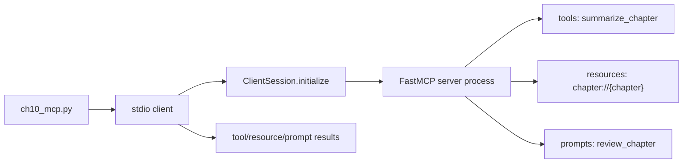

# Chapter 10. MCP 기초

## 목표

- Model Context Protocol이 host와 external capability 사이의 표준 연결 계층이라는 점을 이해합니다.
- `FastMCP` server가 tool, resource, prompt를 어떻게 노출하는지 확인합니다.
- stdio client가 server process를 시작하고 `ClientSession`으로 initialize/list/read/call 흐름을 실행하는 과정을 봅니다.

## 핵심 개념

- MCP server는 model 자체가 아니라 host가 사용할 수 있는 capability surface를 제공합니다.
- Tool은 structured input을 받는 callable action입니다.
- Resource는 host가 읽을 수 있는 context URI입니다.
- Prompt는 재사용 가능한 workflow instruction입니다.
- 이번 장은 배포용 remote connector가 아니라 local stdio 학습 예제입니다.

## 흐름



## 실행 명령

```bash
uv run python examples/ch10_mcp.py discover
uv run python examples/ch10_mcp.py resource
uv run python examples/ch10_mcp.py prompt
uv run python examples/ch10_mcp.py tool
uv run python examples/ch10_mcp.py full
uv run python examples/ch10_mcp.py mcp
```

각 MCP 명령이 보여주는 동작:

- `discover`: `initialize`, `list_tools`, `list_resource_templates`, `list_prompts`로 server capability를 발견합니다.
- `resource`: `read_resource uri=chapter://resource` 호출과 resource response를 봅니다.
- `prompt`: `get_prompt name=review_chapter` 호출과 prompt message response를 봅니다.
- `tool`: `call_tool name=summarize_chapter` 호출과 tool result response를 봅니다.
- `full`: discover, resource, prompt, tool 흐름을 한 번에 실행합니다.
- `mcp`: 기존 명령과의 호환을 위해 `full`과 같은 흐름을 실행합니다.

출력에는 `mcp call trace:`가 포함되어 실제 client request와 server response 흐름을 단계별로 보여 줍니다.

## 확인할 출력/테스트

CLI에서 확인할 부분:

- `mcp call trace:`에서 client request와 server response 흐름을 단계별로 확인합니다.
- `discover`는 tool, resource template, prompt 목록을 보여 주는지 확인합니다.
- `resource`, `prompt`, `tool` mode가 각각 read/get/call 흐름을 분리해서 보여 주는지 확인합니다.

테스트:

```bash
uv run pytest tests/test_chapters.py::test_ch10_mcp_demo_exposes_tool_resource_and_prompt_over_stdio -q
uv run pytest tests/test_chapters.py::test_ch10_mcp_demo_supports_focused_flows -q
uv run pytest tests/test_examples.py::test_ch10_mcp_tool_mode_prints_actual_tool_call_trace -q
```
