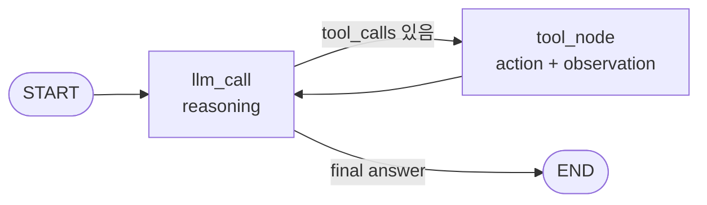

# Chapter 11. ReAct Agent

## 목표

- ReAct의 reasoning, action, observation, final answer loop를 이해합니다.
- Chapter 04의 calculator tool calling과 Chapter 06의 LangGraph loop를 하나의 agent workflow로 연결합니다.
- 기본 fake model과 local calculator tool만 사용해 외부 API 없이 agent 흐름을 검증합니다.
- opt-in 설정으로 OpenAI 또는 Anthropic 실제 모델에서도 같은 ReAct loop를 실행합니다.

## 핵심 개념

- ReAct는 model이 바로 답을 끝내지 않고 필요한 action을 고른 뒤, observation을 보고 다시 final answer를 만듭니다.
- 이번 장의 graph는 `llm_call -> tool_node -> llm_call` 반복 구조입니다.
- `llm_call` node는 model에 tool schema를 제공하고 tool call 여부를 결정합니다.
- `tool_node`는 allowlist에 있는 calculator만 실행하고 결과를 `ToolMessage` observation으로 추가합니다.
- final answer가 나오면 conditional edge가 `END`로 이동합니다.

## 흐름



## 실행 명령

```bash
uv run python examples/ch11_react_agent.py "12 * (7 + 3)"
uv run python examples/ch11_react_agent.py "What is ReAct?"
uv run python examples/ch11_react_agent.py --verbose "12 * (7 + 3)"
RUN_AGENT_LEARNING_INTEGRATION=1 AGENT_LEARNING_PROVIDER=openai uv run python examples/ch11_react_agent.py "12 * (7 + 3)"
RUN_AGENT_LEARNING_INTEGRATION=1 AGENT_LEARNING_PROVIDER=anthropic uv run python examples/ch11_react_agent.py "12 * (7 + 3)"
```

## 확인할 출력/테스트

CLI에서 확인할 부분:

- 기본 출력: `react agent:`, `mode:`, `tool:`, `steps:`, `final answer:`
- `--verbose`: graph nodes, react steps, messages, provider config

테스트:

```bash
uv run pytest tests/test_chapters.py::test_ch11_react_agent_runs_reason_action_observation_loop -q
uv run pytest tests/test_chapters.py::test_ch11_react_agent_rejects_blank_question -q
uv run pytest tests/test_chapters.py::test_ch11_example_uses_opt_in_provider_selection -q
uv run pytest tests/test_examples.py::test_all_examples_print_concise_output_by_default -q
uv run pytest tests/test_examples.py::test_all_examples_preserve_detailed_learning_trace_with_verbose -q
RUN_AGENT_LEARNING_INTEGRATION=1 uv run pytest tests/test_provider_integration.py::test_selected_provider_react_agent_integration -v
```
