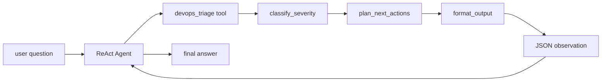

# Chapter 12. GraphTool

## 목표

- LangGraph workflow를 LangChain `StructuredTool`로 감싸는 GraphTool 패턴을 이해합니다.
- Chapter 11 ReAct Agent가 단일 local function이 아니라 deterministic subgraph를 tool action으로 호출하는 흐름을 봅니다.
- DevOps triage 예제를 통해 graph node output이 JSON observation으로 agent에 돌아가는 경계를 확인합니다.
- 기본 fake model과 local graph만 사용해 외부 API 없이 agent + graph tool 흐름을 검증합니다.

## 핵심 개념

- GraphTool은 복잡한 workflow를 agent 입장에서는 하나의 tool로 노출합니다.
- 이번 장의 tool schema는 `TriageInput` Pydantic model에서 생성됩니다.
- `devops_triage` tool은 내부적으로 `classify_severity -> plan_next_actions -> format_output` LangGraph를 실행합니다.
- tool output은 dict로 반환되고, ReAct Agent의 `tool_node`가 JSON `ToolMessage` observation으로 기록합니다.
- final answer는 model이 observation을 받은 뒤 생성합니다.

## 흐름



## 실행 명령

```bash
uv run python examples/ch12_graphtool.py "triage checkout 500 errors increased in prod"
uv run python examples/ch12_graphtool.py "triage catalog latency in staging"
uv run python examples/ch12_graphtool.py --verbose "triage checkout 500 errors increased in prod"
RUN_AGENT_LEARNING_INTEGRATION=1 AGENT_LEARNING_PROVIDER=openai uv run python examples/ch12_graphtool.py "triage checkout 500 errors increased in prod"
RUN_AGENT_LEARNING_INTEGRATION=1 AGENT_LEARNING_PROVIDER=anthropic uv run python examples/ch12_graphtool.py "triage checkout 500 errors increased in prod"
```

## 확인할 출력/테스트

CLI에서 확인할 부분:

- 기본 출력: `graphtool:`, `mode:`, `registered tools:`, `input shape:`, `steps:`, `final answer:`
- `--verbose`: tool schema, graph nodes, react steps, observation, messages

테스트:

```bash
uv run pytest tests/test_chapters.py::test_ch12_graph_tool_wraps_runnable_and_returns_json_ready_dict -q
uv run pytest tests/test_chapters.py::test_ch12_devops_triage_graph_generates_deterministic_actions -q
uv run pytest tests/test_chapters.py::test_ch12_graphtool_react_agent_calls_devops_triage_graph -q
uv run pytest tests/test_examples.py::test_all_examples_print_concise_output_by_default -q
uv run pytest tests/test_examples.py::test_all_examples_preserve_detailed_learning_trace_with_verbose -q
```
