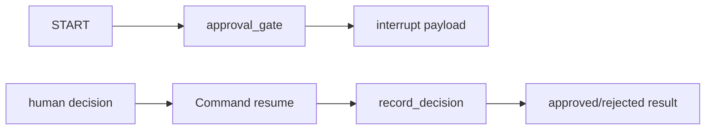

# Chapter 13. Human-in-the-loop

## 목표

- LangGraph `interrupt`로 workflow를 중단하고 사람의 결정을 기다리는 흐름을 이해합니다.
- `Command(resume=...)`와 `thread_id`가 같은 graph run을 이어 주는 방식을 확인합니다.
- incident action을 승인하거나 거절하는 gate를 통해 위험한 action을 자동 실행하지 않는 경계를 학습합니다.
- 기본 실행은 local graph와 deterministic decision만 사용해 외부 API 없이 검증합니다.

## 핵심 개념

- Human-in-the-loop은 agent나 graph가 위험한 action을 바로 실행하지 않고 사람에게 decision payload를 노출하는 패턴입니다.
- 이번 장의 `approval_gate` node는 service, environment, symptom, recommended action을 interrupt payload로 반환합니다.
- caller는 같은 `thread_id`에서 `Command(resume={"approved": ..., "reason": ...})`로 graph를 재개합니다.
- `record_decision` node는 승인/거절 결과만 기록하며 paging, rollback, deployment 같은 production action은 실행하지 않습니다.

## 흐름



## 실행 명령

```bash
uv run python examples/ch13_human_in_loop.py "triage checkout 500 errors increased in prod"
uv run python examples/ch13_human_in_loop.py "triage catalog latency in staging"
uv run python examples/ch13_human_in_loop.py --verbose "triage checkout 500 errors increased in prod"
```

## 확인할 출력/테스트

CLI에서 확인할 부분:

- 기본 출력: `human-in-the-loop:`, `mode: local`, `decision:`, `status:`, `final answer:`
- `--verbose`: graph nodes, interrupt payload, resume command, approval trace

테스트:

```bash
uv run pytest tests/test_chapters.py::test_ch13_incident_gate_approves_recommended_action_without_side_effects -q
uv run pytest tests/test_chapters.py::test_ch13_incident_gate_rejects_recommended_action_with_reason -q
uv run pytest tests/test_examples.py::test_all_examples_print_concise_output_by_default -q
uv run pytest tests/test_examples.py::test_all_examples_preserve_detailed_learning_trace_with_verbose -q
```
